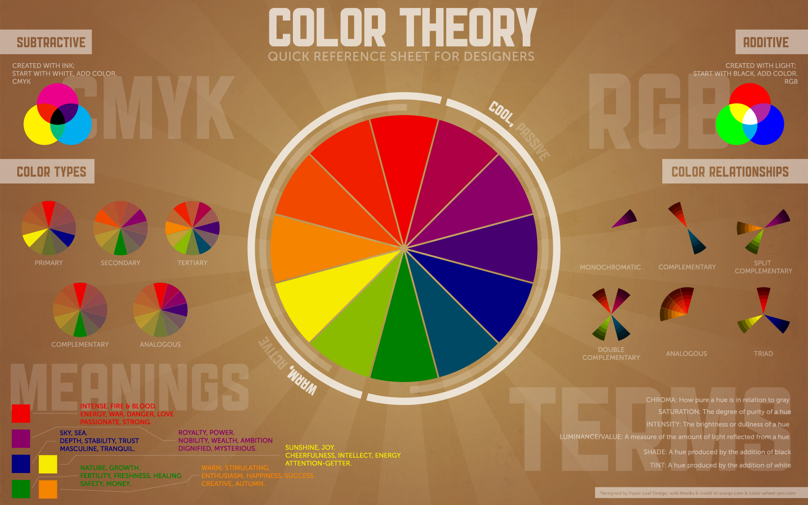

# DIGH 3814 Week 5 Journal

## Contents

1. [new stuff](#new-stuff)
2. [hiccups](#hiccups)
3. [readings](#readings)

## New Stuff

[_back to top_](#contents)

### Subtractive vs Additive colours

In the past, I never knew what CMYK stood for in the real of colours (and frankly, I didn't care enough to check). But I think the chart you included was really informative, I'll defintely be refering to it when next I pick a colour scheme.

For reference: [ColorBrewer](https://colorbrewer2.org)

### Geometric Font

A font whose design is primarily based on geometry. The hidden shapes in the type create a structured effect.

## Hiccups

[_back to top_](#contents)

### WebMaps

When I ran the command the server said it was running but I was unable to view the page.

So I checked Discord and... apparently I'm supposed to use `http://localhost:8000/` instead of `http://0.0.0.0:8000/`. Another case the Discord group rescued!

### Stress

This is more of a rant than anything. If I'm to be completely honest this week's work was really stressful. I had my computer run out of disk space twice. Working with Inkscape slowed my computer down so much that I could only type 1 character each second and this was compounded ontop of my laptop potentially having a virus. The challenges I faced this week I think are pretty evident in my work but hopefully I can bring things back up next week.

## Readings

[_back to top_](#contents)

### Making Nerdstep Music as Archaeological Enchantment, or, How do you Connect with People Who Lived 3000 Years Ago?

- I really liked when the author mentioned that if a song -- composed based on the posessions of those who lived in the plateau, in the tufa landscape of southern Etruria -- were to be performed in a club, the dancers would effectively be embodying our archaeological knowledge of Poggio in their movements.

  - Makes you think, what are the roots of our mainstream, popular music today?

  - The instruments that we use -- the piano, violin, flute, **drums**, etc. -- were invented many, many years ago. What were they used for back then?

  - I can't help but feel that the same energy of the composers who first invented these instruments has left a lasting impact on our music now by virtue of the instrument itself.

### Songs of the Ottawa

- This is honestly one of the most well-presented DH websites I've seen.

- I really like her "On the Water" sonification. The combination of the 3 boats 'sounds' really made for a more cohesive track. To be honest, I was a little skeptical when I listend to "song of the Ottawa" but when I read that the tracks were actually composed by muxing several monotonic tracks, it made so much sense!

### Types of Visualizations

I made a list of all the new visualisations I discovered through the text so that I can refer back later

- _(sideways)_ **Stacked Bar Chart**: Great for showing qualitative<->quantitative data without clutter

- **Choropleth**: Bounded regions on a map are coloured/shaded to represent a statistical variable

- **Dot Density Map**: Provides increased granularity over the Choropleth

- **Proportional Symbol Map**: For representing absolute values on maps. _Doesn't lend much for detailed interpretation._

- **Isopleth/Isarithmic/Contour Maps**: Represent gradual geographic change. Best for data that contains smooth transitions.

- **Cartograms**: Distort the known reference system of latitude and longitude to represent a statistical value

- **Vertical/Horizontal Trees**: Best for showing relationships in hierarchical data. _Emphasises change over time._

- **Radial Tree**: Visalises a set of highly-relational data. _Emphasises centrality instead of time._

- **Treemap**: Hierarchies that represent a quantitative value. Rectangles can be coloured to represent different dimensions of data -- categorical or quantitative.

- **Small Multiples**: Use of multiple, small, adjacent visualisations for the purpose of comparison

- **Sparklines**: Tiny line charts with no axis or legend used to show change of a single item
